# Мои студенческие проекты

Выборка из моего личного архива лабораторных работ и студенческих проектов. 
Возможно, для других это будет бесполезная свалка кода, но для меня это память о прекрасных днях (и бессонных ночах) моего студенчества. 😊

Многое пришлось исключить из данного репозитория, т.к. сейчас там черт ногу сломит 😈: куча документов, неработающий код, какие-то программы и прочее. К тому же не стал включать уж совсем тривиальные вещи, типа bat-файлов, hello-world проектов и так далее. 

В релизах можно скачать архив, в котором присутствуют сборки (exe-файлы с ресурсами) и электронные методички.

## Примеры проектов

### Решение полной проблемы собственных значений методом А. М. Данилевского

Матчасть можно найти [тут](http://sa.technolog.edu.ru/files/chumakov/Sobstvennye%20znachenija.pdf)

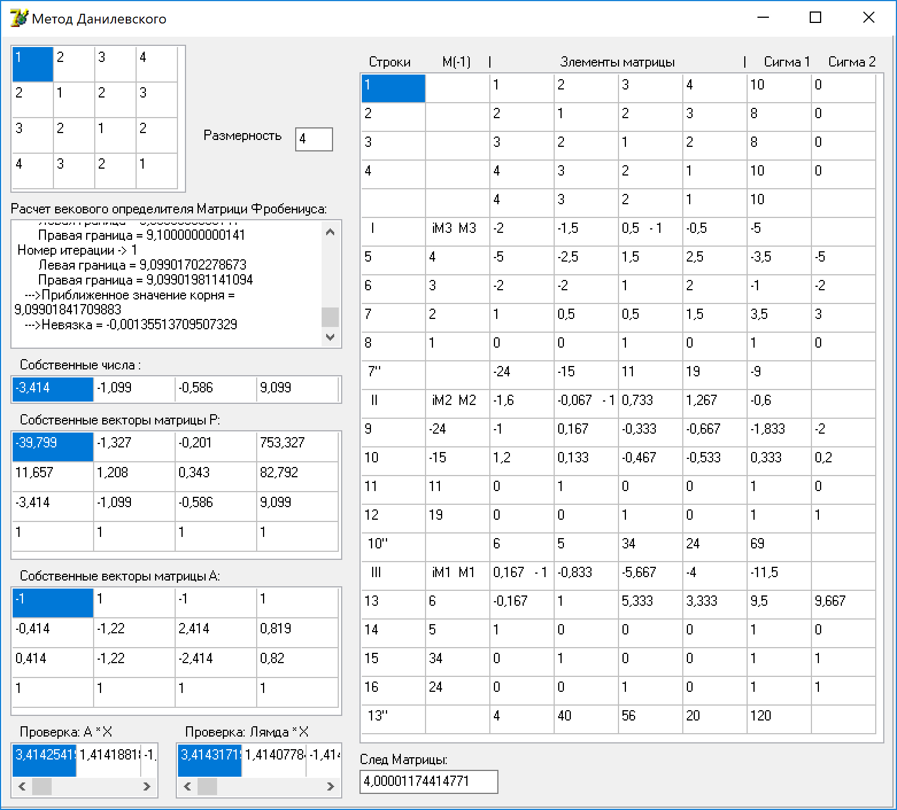

---

### Вычисление интерполяционного многочлена Лагранжа итерационным способом Эйткена

Матчасть [здесь](https://ru.wikipedia.org/wiki/%D0%A1%D1%85%D0%B5%D0%BC%D0%B0_%D0%AD%D0%B9%D1%82%D0%BA%D0%B5%D0%BD%D0%B0)

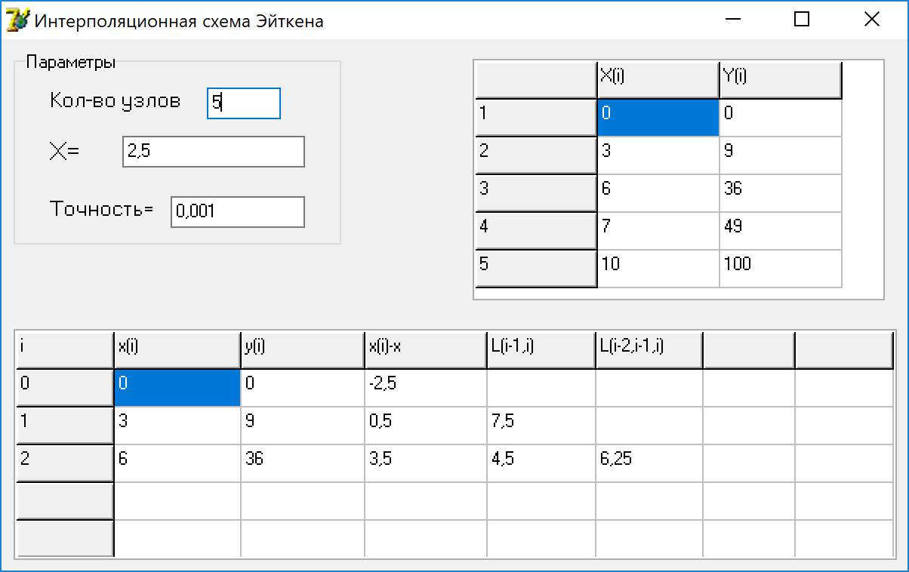

---

### Нахождение локального экстремума функции с помощью метода наискорейшего градиентного спуска

Матан читать [тут](http://www.machinelearning.ru/wiki/index.php?title=%D0%9C%D0%B5%D1%82%D0%BE%D0%B4_%D0%B3%D1%80%D0%B0%D0%B4%D0%B8%D0%B5%D0%BD%D1%82%D0%BD%D0%BE%D0%B3%D0%BE_%D1%81%D0%BF%D1%83%D1%81%D0%BA%D0%B0)

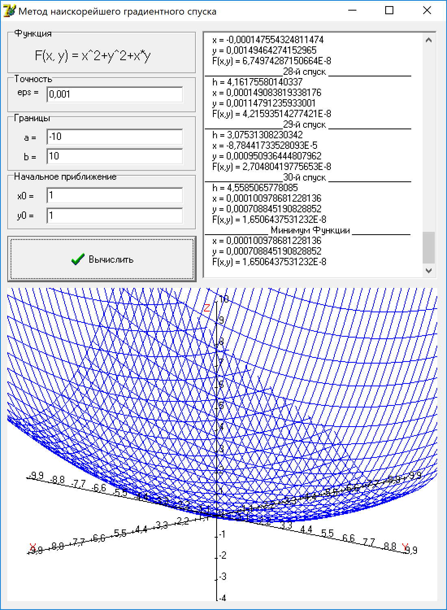

---

### Сравнение методов Рунге-Кутты и Адамса для решения дифференциальных уравнений первого порядка

Почитать про [метод Рунге-Кутты](https://ru.wikipedia.org/wiki/%D0%9C%D0%B5%D1%82%D0%BE%D0%B4_%D0%A0%D1%83%D0%BD%D0%B3%D0%B5_%E2%80%94_%D0%9A%D1%83%D1%82%D1%82%D1%8B) и [метод Адамса](https://ru.wikipedia.org/wiki/%D0%9C%D0%B5%D1%82%D0%BE%D0%B4_%D0%90%D0%B4%D0%B0%D0%BC%D1%81%D0%B0)

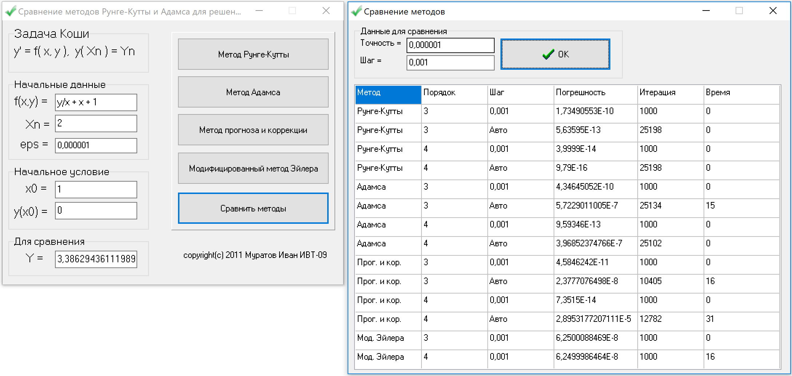

---

### Аффинные преобразования

Почитать про математику можно [здесь](https://ru.wikipedia.org/wiki/%D0%90%D1%84%D1%84%D0%B8%D0%BD%D0%BD%D0%BE%D0%B5_%D0%BF%D1%80%D0%B5%D0%BE%D0%B1%D1%80%D0%B0%D0%B7%D0%BE%D0%B2%D0%B0%D0%BD%D0%B8%D0%B5)

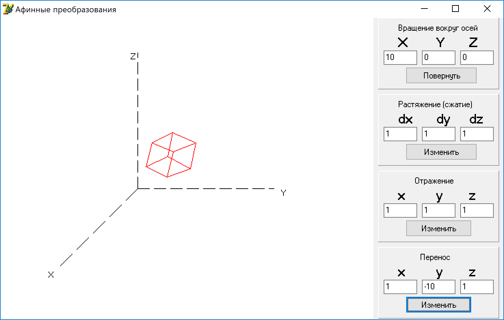

---

### Гистограммы

Информация о графических гистограммах [здесь](https://ru.wikipedia.org/wiki/%D0%93%D0%B8%D1%81%D1%82%D0%BE%D0%B3%D1%80%D0%B0%D0%BC%D0%BC%D0%B0_(%D1%84%D0%BE%D1%82%D0%BE%D0%B3%D1%80%D0%B0%D1%84%D0%B8%D1%8F))

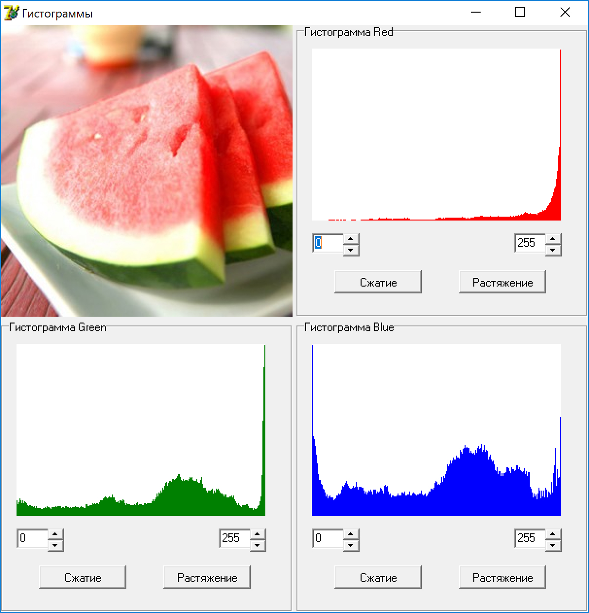

---

### Диффузия

Описание процесса диффузии на [Википедии](https://ru.wikipedia.org/wiki/%D0%94%D0%B8%D1%84%D1%84%D1%83%D0%B7%D0%B8%D1%8F)

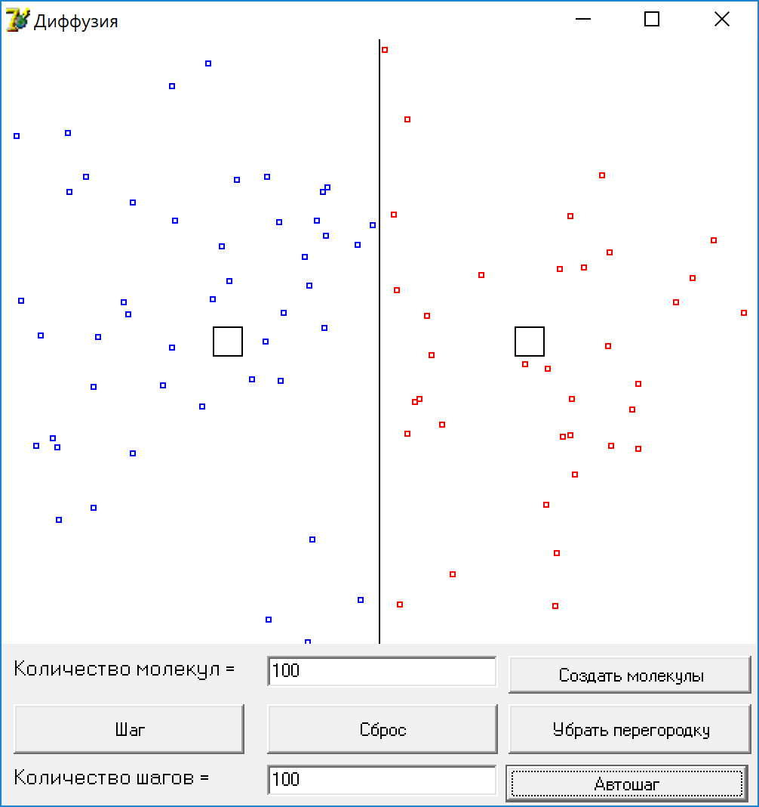

---

### Доска Гальтона

Описание данного устройства [тут](https://ru.wikipedia.org/wiki/%D0%94%D0%BE%D1%81%D0%BA%D0%B0_%D0%93%D0%B0%D0%BB%D1%8C%D1%82%D0%BE%D0%BD%D0%B0)

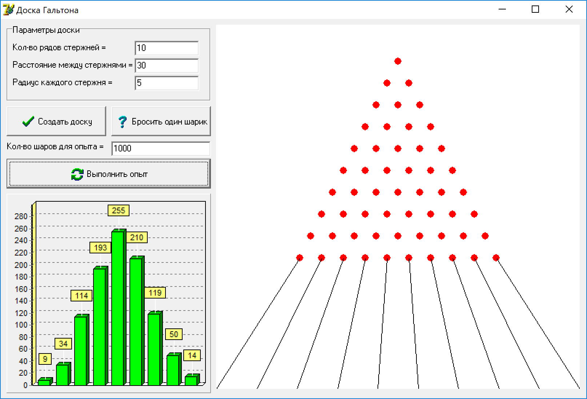

---

### Электрическое поле между 4 зарядами в 3D

Немножко физической природы электических полей [тут](https://ru.wikipedia.org/wiki/%D0%AD%D0%BB%D0%B5%D0%BA%D1%82%D1%80%D0%B8%D1%87%D0%B5%D1%81%D0%BA%D0%BE%D0%B5_%D0%BF%D0%BE%D0%BB%D0%B5)

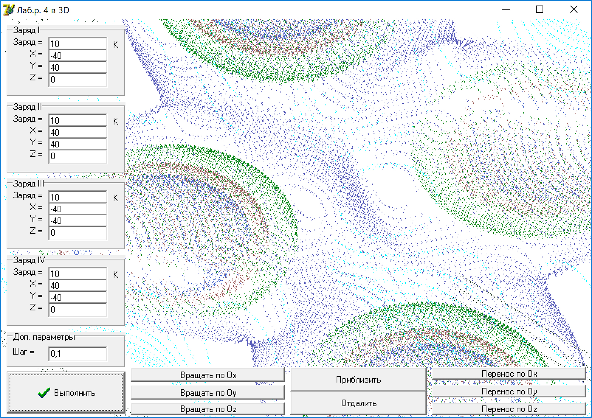

---

### Игра "Жизнь"

[Тут](https://ru.wikipedia.org/wiki/%D0%98%D0%B3%D1%80%D0%B0_%C2%AB%D0%96%D0%B8%D0%B7%D0%BD%D1%8C%C2%BB) можно почитать про игру, если кто еще не знает о ней **O_o**

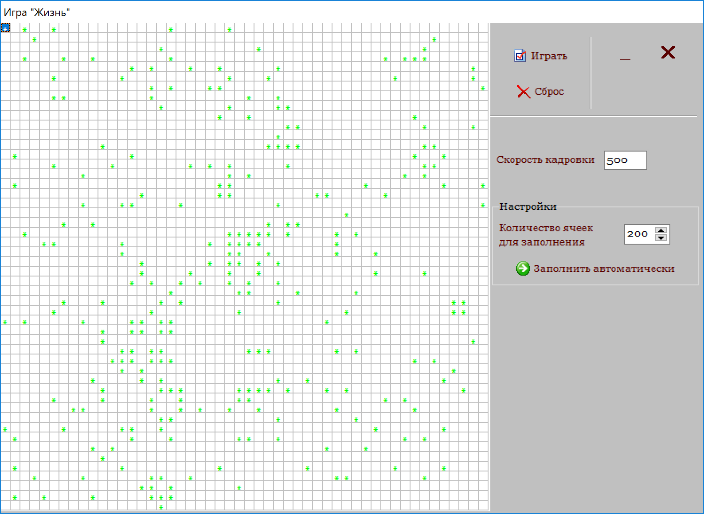

---

### Эксперимент с подбрасыванием монеты

Общую информацию можно найти [здесь](https://ru.wikipedia.org/wiki/%D0%9F%D0%BE%D0%B4%D0%B1%D1%80%D0%B0%D1%81%D1%8B%D0%B2%D0%B0%D0%BD%D0%B8%D0%B5_%D0%BC%D0%BE%D0%BD%D0%B5%D1%82%D1%8B)

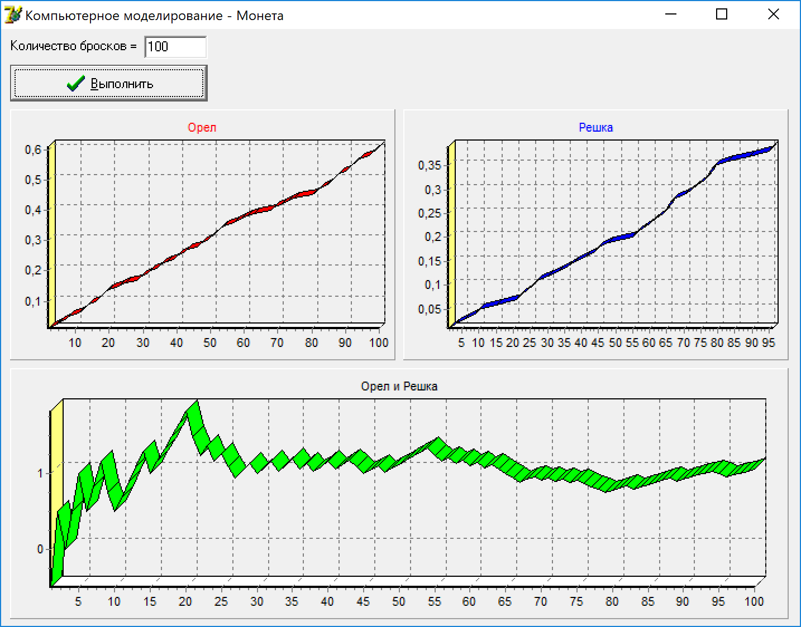

---

### Метод Монте-Карло

Общие сведения о методе можно почитать [тут](https://ru.wikipedia.org/wiki/%D0%9C%D0%B5%D1%82%D0%BE%D0%B4_%D0%9C%D0%BE%D0%BD%D1%82%D0%B5-%D0%9A%D0%B0%D1%80%D0%BB%D0%BE)

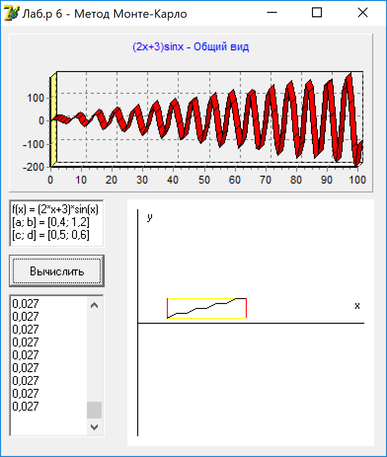

---

### Игла Бюффона

Про задачу Бюффона о бросании иглы можно почитать на [Википедии](https://ru.wikipedia.org/wiki/%D0%97%D0%B0%D0%B4%D0%B0%D1%87%D0%B0_%D0%91%D1%8E%D1%84%D1%84%D0%BE%D0%BD%D0%B0_%D0%BE_%D0%B1%D1%80%D0%BE%D1%81%D0%B0%D0%BD%D0%B8%D0%B8_%D0%B8%D0%B3%D0%BB%D1%8B)

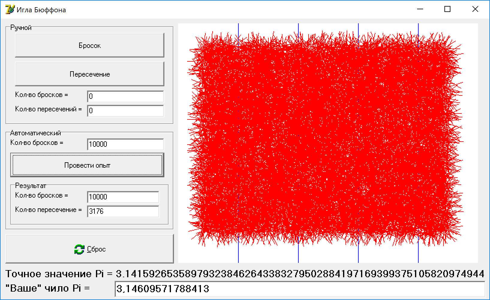

---

### Метод Амперметра-Вольтметра

Про метод можно узнать [тут](http://www.sonel.ru/ru/biblio/article/resistance-directcurrent/)

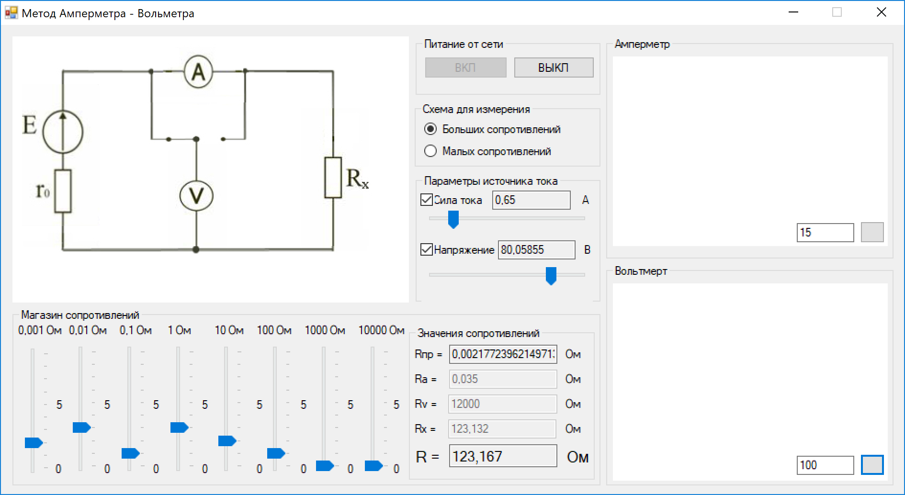

---

### Метод наименьших квадратов

Матчасть метода [здесь](https://ru.wikipedia.org/wiki/%D0%9C%D0%B5%D1%82%D0%BE%D0%B4_%D0%BD%D0%B0%D0%B8%D0%BC%D0%B5%D0%BD%D1%8C%D1%88%D0%B8%D1%85_%D0%BA%D0%B2%D0%B0%D0%B4%D1%80%D0%B0%D1%82%D0%BE%D0%B2)

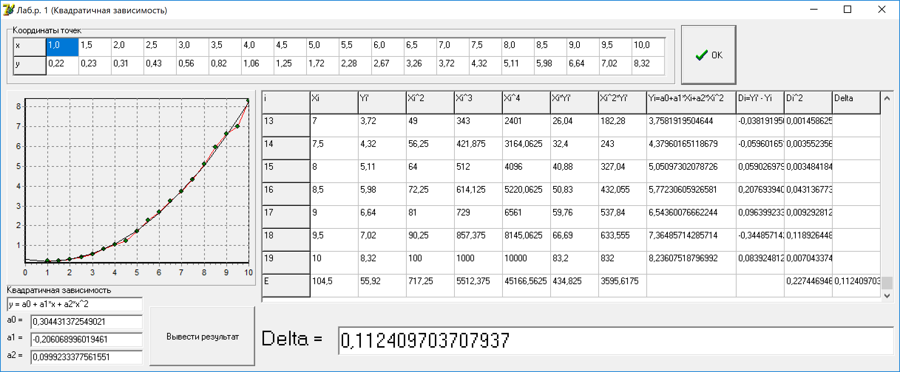

---

### Гомоморфизм графа

---

### Поиск кратчайшего пути алгоритмом Форда-Беллмана

Матчасть [здесь](https://ru.wikipedia.org/wiki/%D0%90%D0%BB%D0%B3%D0%BE%D1%80%D0%B8%D1%82%D0%BC_%D0%91%D0%B5%D0%BB%D0%BB%D0%BC%D0%B0%D0%BD%D0%B0_%E2%80%94_%D0%A4%D0%BE%D1%80%D0%B4%D0%B0)

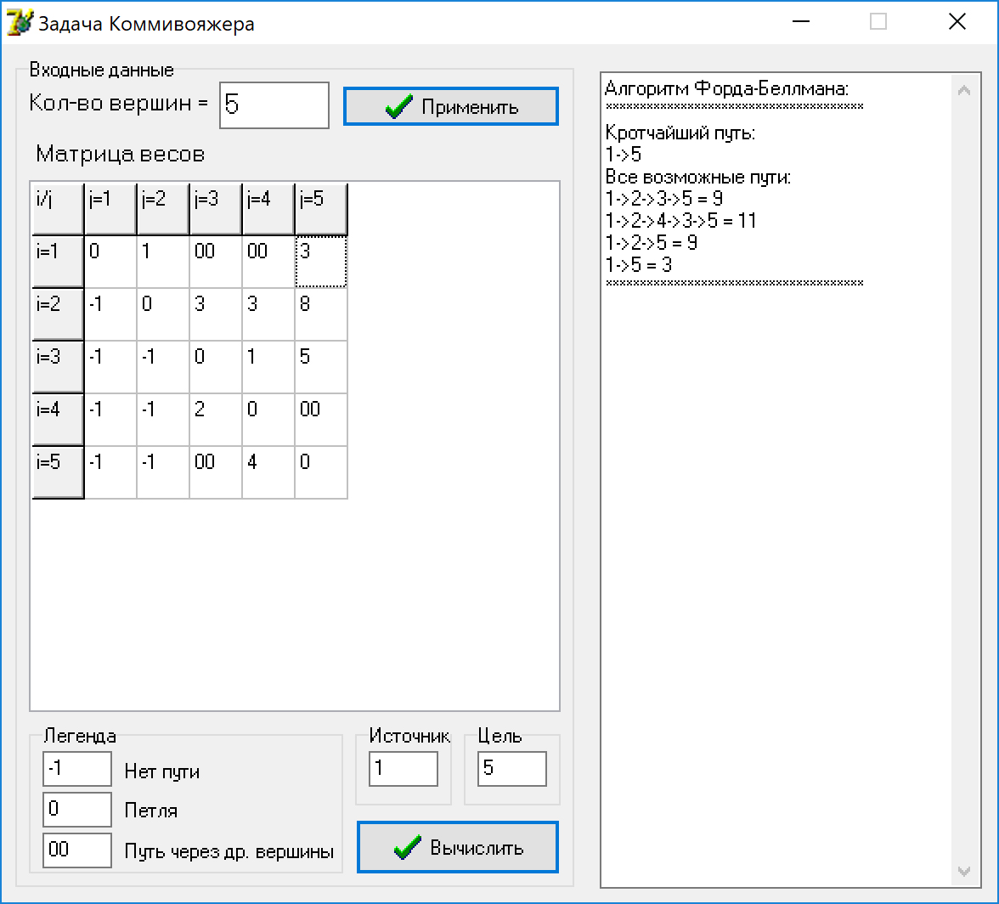

---

### Криптографические алгоритмы

Список алгоритмов: [Метод перестановок](https://ru.wikipedia.org/wiki/%D0%9F%D0%B5%D1%80%D0%B5%D1%81%D1%82%D0%B0%D0%BD%D0%BE%D0%B2%D0%BE%D1%87%D0%BD%D1%8B%D0%B9_%D1%88%D0%B8%D1%84%D1%80), [Метод Виженера](https://ru.wikipedia.org/wiki/%D0%A8%D0%B8%D1%84%D1%80_%D0%92%D0%B8%D0%B6%D0%B5%D0%BD%D0%B5%D1%80%D0%B0), [Гаммирование](https://ru.wikipedia.org/wiki/%D0%93%D0%B0%D0%BC%D0%BC%D0%B8%D1%80%D0%BE%D0%B2%D0%B0%D0%BD%D0%B8%D0%B5), [RSA](https://ru.wikipedia.org/wiki/RSA), [Алгоритм Эль-Гамаля](https://ru.wikipedia.org/wiki/%D0%A1%D1%85%D0%B5%D0%BC%D0%B0_%D0%AD%D0%BB%D1%8C-%D0%93%D0%B0%D0%BC%D0%B0%D0%BB%D1%8F), [DES](https://ru.wikipedia.org/wiki/DES)

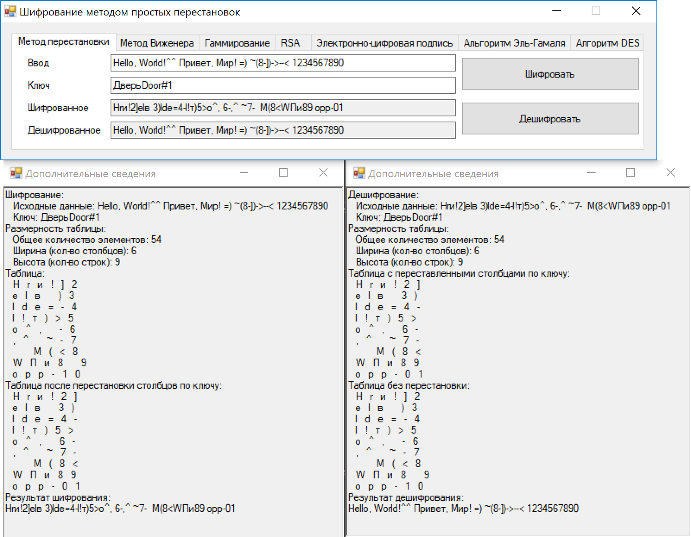

---

### Методы оптимизации

Список алгоритмов: [Метод половинного деления](https://ru.wikipedia.org/wiki/%D0%9C%D0%B5%D1%82%D0%BE%D0%B4_%D0%B1%D0%B8%D1%81%D0%B5%D0%BA%D1%86%D0%B8%D0%B8), [Метод золотого сечения](https://ru.wikipedia.org/wiki/%D0%9C%D0%B5%D1%82%D0%BE%D0%B4_%D0%B7%D0%BE%D0%BB%D0%BE%D1%82%D0%BE%D0%B3%D0%BE_%D1%81%D0%B5%D1%87%D0%B5%D0%BD%D0%B8%D1%8F), [Метод Гаусса](https://ru.wikipedia.org/wiki/%D0%9C%D0%B5%D1%82%D0%BE%D0%B4_%D0%93%D0%B0%D1%83%D1%81%D1%81%D0%B0_(%D0%BE%D0%BF%D1%82%D0%B8%D0%BC%D0%B8%D0%B7%D0%B0%D1%86%D0%B8%D1%8F)), [Метод Хука-Дживса](https://ru.wikipedia.org/wiki/%D0%9C%D0%B5%D1%82%D0%BE%D0%B4_%D0%A5%D1%83%D0%BA%D0%B0_%E2%80%94_%D0%94%D0%B6%D0%B8%D0%B2%D1%81%D0%B0), [Метод Коши](http://mm.lti-gti.ru/works_lectures/1.htm), [Метод Ньютона](https://ru.wikipedia.org/wiki/%D0%9C%D0%B5%D1%82%D0%BE%D0%B4_%D0%9D%D1%8C%D1%8E%D1%82%D0%BE%D0%BD%D0%B0)

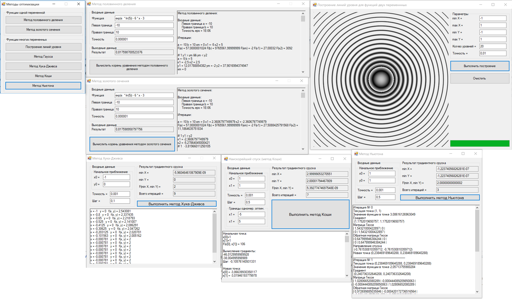

---

### Дискретизация аналоговых сигналов

Немного матчасти [тут](https://studfiles.net/preview/6325705/)

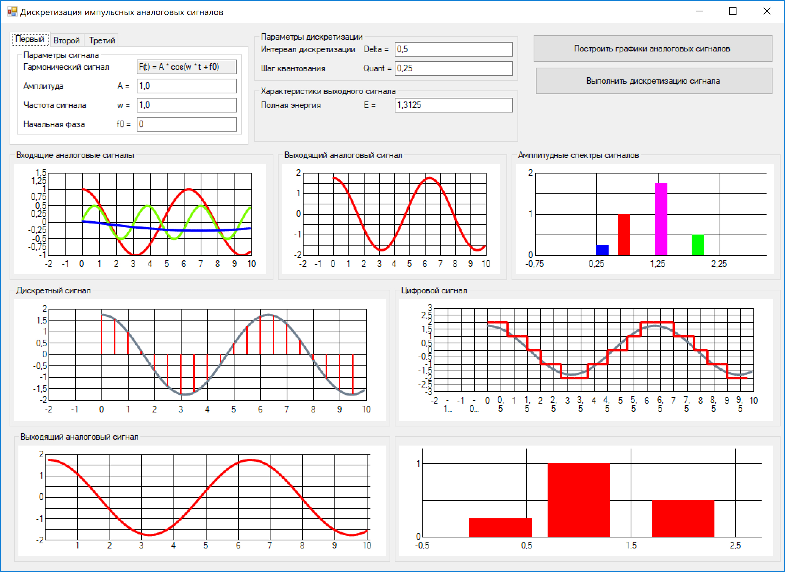

---

> И там еще куча всего, включая структуры и алгоритмы обработки данных, решения различных математических задач и так далее, и тому подобное.

---

## TL;DR

Огромное спасибо моему [ВУЗу](http://zabgu.ru), в частости [Энергетическому факультету](http://zabgu.ru/php/page.php?query=e%27nergeticheskij_fakul%27tet), в частности [Кафедре информатики, вычислительной техники
и прикладной математики (ИВТиПМ)](http://zabgu.ru/php/page.php?query=kafedra_ivtipm). ❤️ 

> ⭐️ ИВТ-09 4EVER ⭐️
